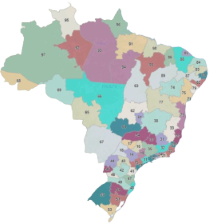
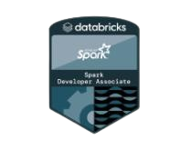
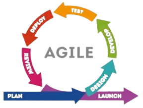
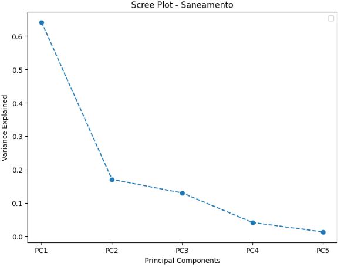

---
hide:
  - navigation
  - toc
---

-   
 
 

    ---
    

    Este case utiliza dados da ANAC e do INMET para desenvolver um modelo preditivo de atrasos de voos. Abrange todas as fases de um projeto de ciência de dados, incluindo extração, limpeza, análise exploratória, modelagem, treinamento, avaliação de desempenho e documentação. O objetivo final é preparar o projeto para a implementação do modelo em produção." 

    

    ---
    
[Clique aqui](https://pedromateusalmeida.github.io/aviacao_brasileira/case/){ .md-button-small .md-button--primary }

-   
 
 

    ---
    

    Este projeto visa praticar o ciclo completo de ciência de dados, incluindo extração, tratamento e análise de dados, com ênfase na adaptabilidade a diferentes negócios. O processo abrange a criação e implementação de um modelo, seu monitoramento e uma documentação detalhada do projeto. (Em andamento)  

    ---
    
[Clique aqui](https://pedromateusalmeida.github.io/receita-federal-api/){ .md-button-small .md-button--primary }

-   
 

    ---
    

    O objetivo desse tratamento é centralizar todas as regras da telefonia brasileira nos últimos 30 anos. Ao final será possível obter informações como a classificação entre telefone fixo e móvel, qual estado, qual macro região, se é um telefone celular valido e qual é a operadora do telefone móvel.  

    ---
    
[Clique aqui](https://pedromateusalmeida.github.io/aviacao_brasileira/case/){ .md-button-small .md-button--primary }

-   
 
  

    ---
    

    O objetivo desse projeto é compartilhar qual foi minha trajetória para ser aprovado na certificação do Pyspark. O que estudei, onde estudei, quais os conceitos fundamentais, quais funções tive que aprender.      

    ---
    
[Clique aqui](https://pedromateusalmeida.github.io/spark-certification/){ .md-button-small .md-button--primary }

-   
 

    ---
    

    Esse projeto é um compilado de informações e anotações dos meus estudos que fiz sobre metodologias ágeis. A ideia é que essa seja uma documentação viva, então a medida que eu for estudando mais informações sobre a filosofia ágil e suas aplicações em forma de métodos de trabalho pretendo incrementar nessa documentação.   

    ---

    
[Clique aqui](https://pedromateusalmeida.github.io/metodologia_agil_documentation/metodologia_agil_def/){ .md-button-small .md-button--primary }

-   
 
 

    ---
    

    Este projeto envolveu a utilização de dados da aviação brasileira com o objetivo de desenvolver um modelo de inteligência artificial capaz de identificar e sugerir riscos potenciais de acidente aos pilotos. O foco principal foi analisar padrões e tendências nos dados históricos de voo para criar um sistema que auxilie na tomada de decisões mais seguras durante as operações aéreas, aumentando assim a segurança de voo e prevenindo acidentes.

    ---
    
[Clique aqui](https://slides.com/pedromateusalmeida/deck/fullscreen){ .md-button-small .md-button--primary }

-   
 

    ---
    

    Esse trabalho foi desenvolvido na disciplina de Estatística Multivariada que foi cursada na pós de estatística computacional da UFMG. Trabalhamos os conceitos, aplicações de técnicas de PCA e EFA e interpretação dos resultados.

    ---
    
[Clique aqui](https://github.com/pedromateusalmeida/caderno_estatistica/tree/main/PCA_EFA){ .md-button-small .md-button--primary }

