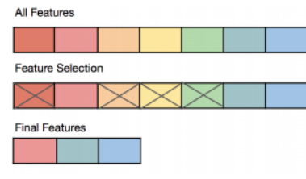
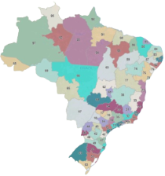
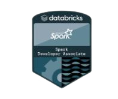
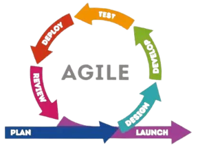
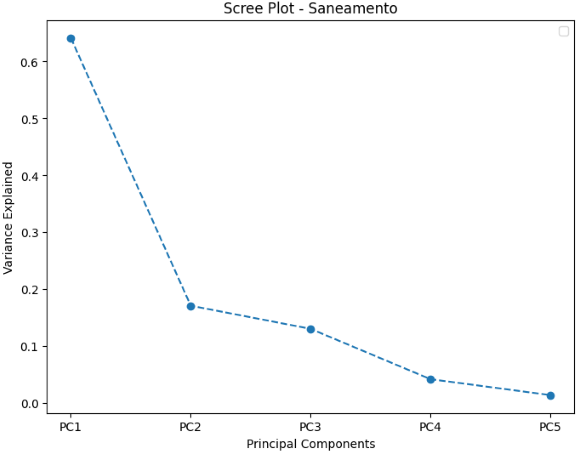
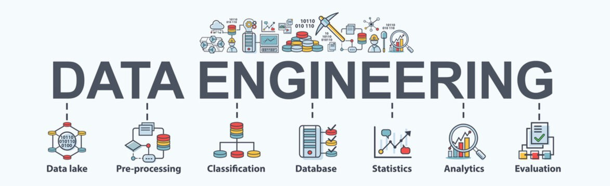

---
hide:
  - navigation
  - toc
---

-   

 

    ---
    Este case utiliza dados da ANAC e do INMET para desenvolver um modelo preditivo de atrasos de voos. Abrange todas as fases de um projeto de ciência de dados, incluindo extração, limpeza, análise exploratória, modelagem, treinamento, avaliação de desempenho e documentação. O objetivo final é preparar o projeto para a implementação do modelo em produção.

    Python Machine Learning Scikit-Learn EDA ANAC

    ---
    
[Clique aqui](https://pedromateusalmeida.github.io/aviacao_brasileira/case/){ .md-button-small .md-button--primary }

-   

 

    ---
    Este projeto visa praticar o ciclo completo de ciência de dados, incluindo extração, tratamento e análise de dados, com ênfase na adaptabilidade a diferentes negócios. O processo abrange a criação e implementação de um modelo, seu monitoramento e uma documentação detalhada do projeto. (Em andamento)

    Python Engenharia de Dados APIs ETL Data Quality

    ---
    
[Clique aqui](https://pedromateusalmeida.github.io/receita-federal-api/){ .md-button-small .md-button--primary }

-   

    ---
    Este estudo utiliza dados diários do Bitcoin obtidos do Yahoo Finance, com o objetivo de prever o preço de fechamento do Bitcoin usando modelos de séries temporais. As etapas incluem extração de dados, transformação, limpeza, análise exploratória, testes de estacionariedade, autocorrelação, memória da série e outros. Os modelos aplicados foram regressão linear e multilinear, alisamento exponencial, ARIMA, SARIMA, SARIMAX, Auto ARIMA, XGBoost Regressor, GARCH, Prophet e LSTM.

    Python Séries Temporais ARIMA / SARIMAX LSTM Prophet XGBoost

    ---
    
[Clique aqui](https://github.com/pedromateusalmeida/time-series-analysis-bitcoin/blob/main/Scripts%20e%20encodings/Trabalho_pos_script_final.ipynb){ .md-button-small .md-button--primary }

-   

    ---
    O objetivo deste projeto é demonstrar como utilizar o MLflow para gerenciar o ciclo de vida completo de um modelo de aprendizado de máquina, desde o desenvolvimento até a implantação.

    MLOps MLflow Deploy Model Registry Python

    ---
    
[Clique aqui](https://github.com/pedromateusalmeida/using-mlflow-to-deployment-model){ .md-button-small .md-button--primary }

-   

 

    ---
    Este projeto utiliza dados de operações logísticas e cadeia de suprimentos para analisar e prever atrasos em remessas. O estudo avalia fatores como condições de tráfego, temperatura, umidade, tempo de espera, níveis de inventário e utilização de ativos. Além da construção de um modelo de classificação para identificar remessas com alto risco de atraso, o projeto aplica técnicas de séries temporais para prever a demanda futura e gerar recomendações voltadas à otimização da operação logística.

    Python Classificação Séries Temporais Logística

    ---
    
[Clique aqui](https://github.com/pedromateusalmeida/Previs-o-de-atrasos-log-sticos){ .md-button-small .md-button--primary }

-   

 

    ---
    Este estudo apresenta diversas técnicas de Feature Selection, organizadas de forma comparativa quanto ao tipo, variáveis de entrada, distribuição, custo computacional e sensibilidade a outliers e dados desbalanceados. O projeto inclui uma análise prática aplicando diferentes métodos para avaliar impacto na performance dos modelos, auxiliando na escolha da técnica mais adequada para cada cenário.

    Python Feature Selection Scikit-Learn Estatística

    ---
    
[Clique aqui](https://github.com/pedromateusalmeida/metodos_feature_selection){ .md-button-small .md-button--primary }

-   

    ---
    O objetivo desse tratamento é centralizar todas as regras da telefonia brasileira nos últimos 30 anos. Ao final será possível obter informações como a classificação entre telefone fixo e móvel, qual estado, qual macro região, se é um telefone celular válido e qual é a operadora do telefone móvel.

    Python Tratamento de Dados Regex Regras de Negócio

    ---
    
[Clique aqui](https://pedromateusalmeida.github.io/receita-federal-api/tratamento_telefone/){ .md-button-small .md-button--primary }

-   

    ---
    O objetivo desse projeto é compartilhar qual foi minha trajetória para ser aprovado na certificação do PySpark. O que estudei, onde estudei, quais os conceitos fundamentais e quais funções tive que aprender.

    Apache Spark PySpark Databricks Certificação

    ---
    
[Clique aqui](https://pedromateusalmeida.github.io/spark-certification/){ .md-button-small .md-button--primary }

-   

 

    ---
    Este projeto, desenvolvido com dados da ANEEL, tem como objetivo estimar os Custos Operacionais (PMSO) de distribuidoras de energia elétrica no Brasil por meio de modelagem estatística e regressão linear interpretável. O trabalho abrange análise exploratória, testes de normalidade, avaliação de multicolinearidade, seleção de variáveis e análise de resíduos, com foco em apoiar a avaliação de eficiência operacional das empresas do setor.

    Estatística Regressão Linear Econometria ANEEL

    ---
    
[Clique aqui](https://github.com/pedromateusalmeida/Distribui-o-de-Energia---Modelo-de-Estimativa-de-Custos-Operacionais/tree/main){ .md-button-small .md-button--primary }

-   

    ---
    Esse projeto é um compilado de informações e anotações dos meus estudos sobre metodologias ágeis. A ideia é que essa seja uma documentação viva, então, na medida em que eu for estudando mais informações sobre a filosofia ágil e suas aplicações em forma de métodos de trabalho, pretendo incrementar nessa documentação.

    Metodologia Ágil Scrum Kanban Scrumban

    ---
    
[Clique aqui](https://pedromateusalmeida.github.io/metodologia_agil_documentation/metodologia_agil_def/){ .md-button-small .md-button--primary }

-   

 

    ---
    Este projeto envolveu a utilização de dados da aviação brasileira com o objetivo de desenvolver um modelo de inteligência artificial capaz de identificar e sugerir riscos potenciais de acidente aos pilotos. O foco principal foi analisar padrões e tendências nos dados históricos de voo para criar um sistema que auxilie na tomada de decisões mais seguras durante as operações aéreas, aumentando assim a segurança de voo e prevenindo acidentes.

    Inteligência Artificial Gestão de Risco Aviação Python

    ---
    
[Clique aqui](https://slides.com/pedromateusalmeida/deck/fullscreen){ .md-button-small .md-button--primary }

-   

    ---
    Esse trabalho foi desenvolvido na disciplina de Estatística Multivariada, cursada na pós-graduação em Estatística Computacional da UFMG. Trabalhei os conceitos, aplicações de técnicas de PCA e EFA e interpretação dos resultados.

    Estatística Multivariada PCA EFA UFMG R

    ---
    
[Clique aqui](https://github.com/pedromateusalmeida/caderno_estatistica/tree/main/PCA_EFA){ .md-button-small .md-button--primary }

-   

    ---
    Este repositório contém materiais dos estudos que tenho desenvolvido relacionados à engenharia de dados. Os conteúdos abordam desde arquiteturas em nuvem até governança de dados e segurança da informação. São estudos que tenho feito voltados para cloud GCP. 
    - Arquitetura Cloud GCP 
    - Materiais de Governança 
    - Processo de Desenvolvimento da Camada Ouro (Star Schema) 
    - Segurança da Informação 

    Engenharia de Dados Google Cloud Platform Arquitetura Cloud Governança

    ---
    
[Clique aqui](https://github.com/pedromateusalmeida/estudos_engenharia-dados){ .md-button-small .md-button--primary }

